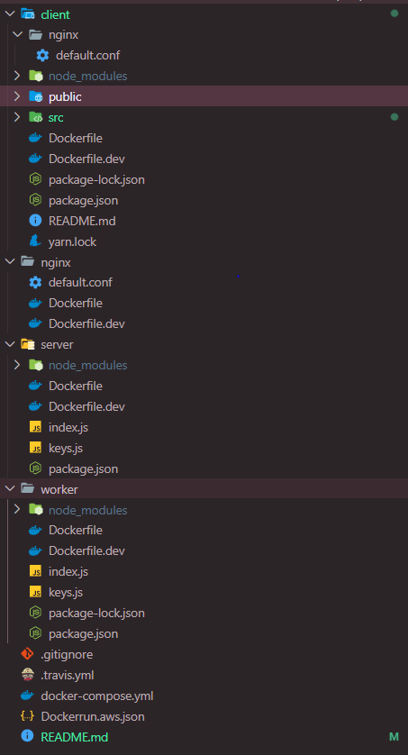

## [Live site](http://multidocker-env-1.eba-finc9rcp.us-east-2.elasticbeanstalk.com/)

## Why this app?

## Architecture Diagram:

## Techstack:

#### Frontend:

    React

#### Backend:

    1. Nodejs
    2. Redis as a worker
    3. Nginx as a web server
    4. Docker
    5. Travis for CI/CD

## Code Struture:

.
